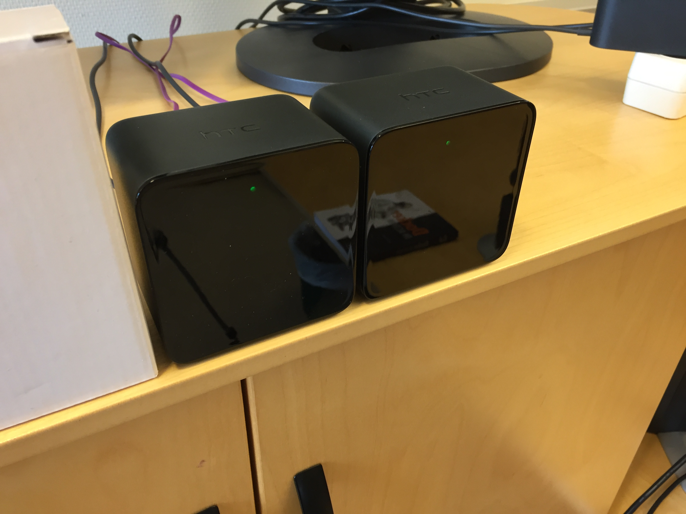

# Relating Experiment to Dataset
This folder contains files with information written by the Teensy in different experimental scenarios to test the accuracy and robustness of the current implementation of the localization-system.

# Data-sets
| Filename |          Primary Purpose          |                                      Comment                                       |
| -------- | --------------------------------- | ---------------------------------------------------------------------------------- |
| 01       | Validate operation                | 2 meter separation from each lighthouse                                            |
| 02       | Pulse duration vs sensor distance | Sensor 1.6m below roof, base-station separation 6m. Moved in discrete steps        |
| 03-1     | Min operation distance            | Base stations next to each other, straight line to sensor and at same height       |
| 03-2     | Max operation distance            | Base stations next to each other, straight line to sensor and at same height       |
| 05       | External light-source             | Sensor stationary between base-stations in roof, blinds open/close + lights on/off |
| 06-1     | Horizontal sensor angle           | Base stations next to each other, sensor 1.6 meter in front, rotated horizontally  |
| 06-2     | Vertical sensor angle             | Base stations next to each other, sensor 1.6 meter in front, rotated vertically    |
| 07-5     | Signal detection verification     | Continuous motion in centre of frame                                               |
| 08       | Angle dependence on distance      | Laser mounted on top of base-station used to ensure sensor angle is not changed    |
| AngAN2   | Angle measurement accuracy        | Measuring using slave base-station on rotating table mounted on screw              |
| AngAN3   | Angle measurement accuracy        | Repeat                                                                             |
| AngAS1   | Angle measurement accuracy        | Slave sideways                                                                     |
| AngAS2   | Angle measurement accuracy        | Repeat                                                                             |
| AngbN1   | Angle measurement accuracy        | Master normal                                                                      |
| AngbN2   | Angle measurement accuracy        | Repeat                                                                             |
| AngbS2   | Angle measurement accuracy        | Master sideways                                                                    |
| AngbS3   | Angle measurement accuracy        | Repeat                                                                             |
| AngbS4   | Angle measurement accuracy        | Rotating mount sideways, base-station upright                                      |
| AngbS5   | Angle measurement accuracy        | Repeat                                                                             |
| Cont1    | Continuous data-measurement       | Continuous measurement with lowered comparator-value                               |
| Cont2    | Continuous data-measurement       | Continuous measurement with reflection-detection enabled                           |

## Images
### 01-05

### 03-06

### 04

### 06

